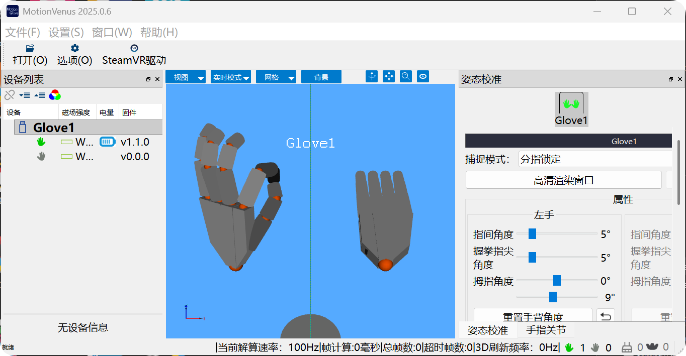
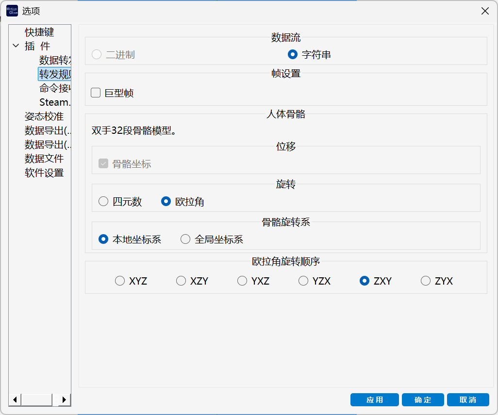
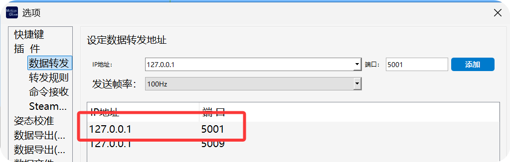
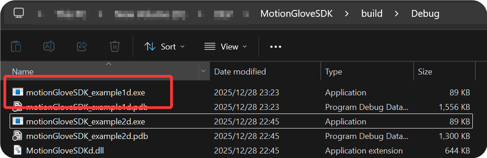
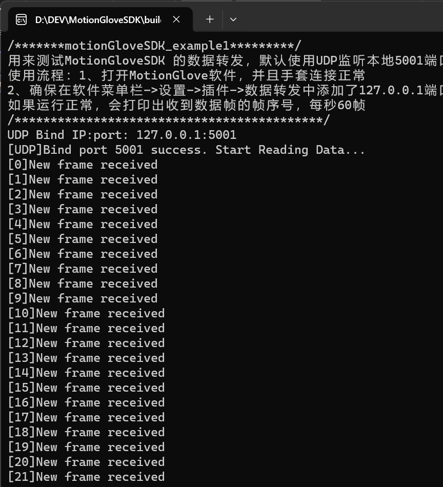
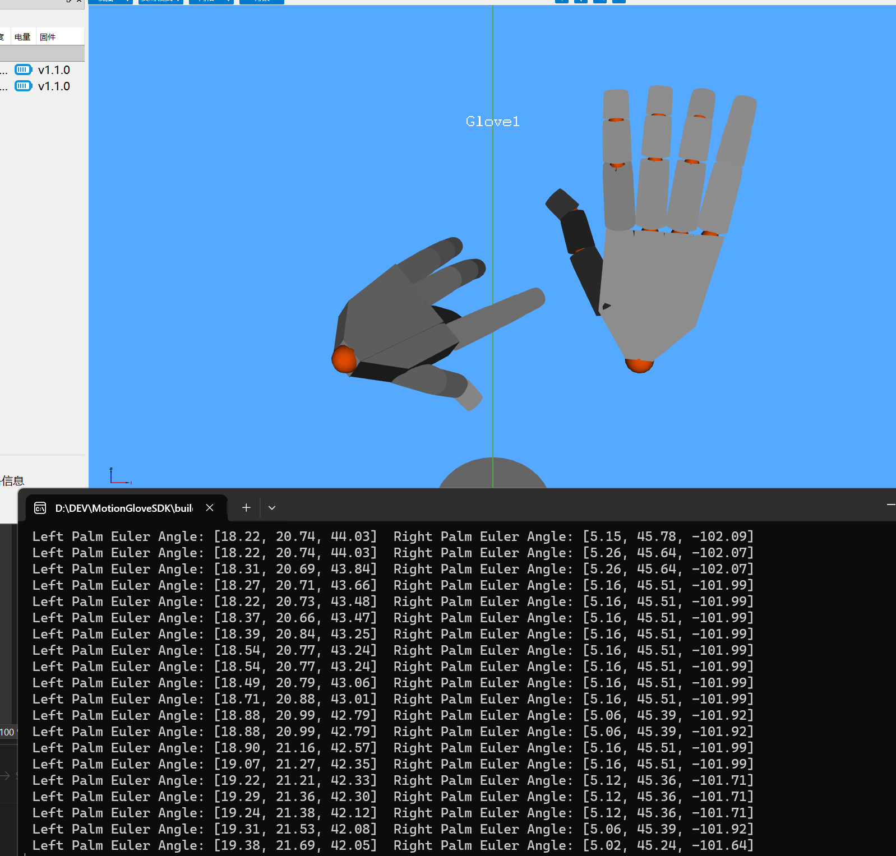
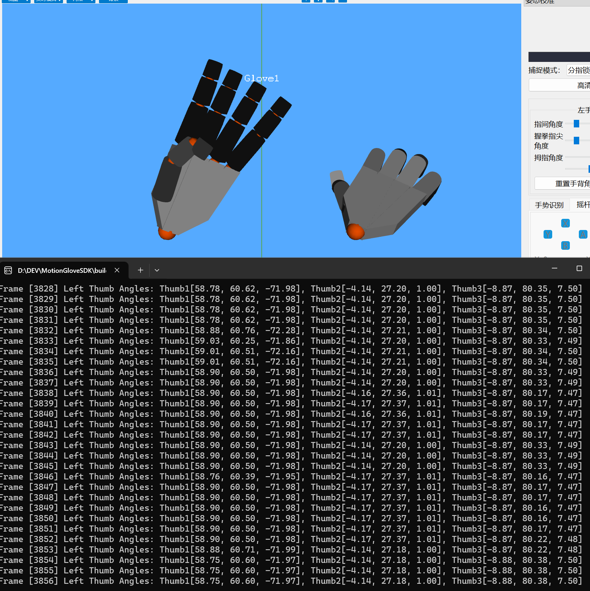
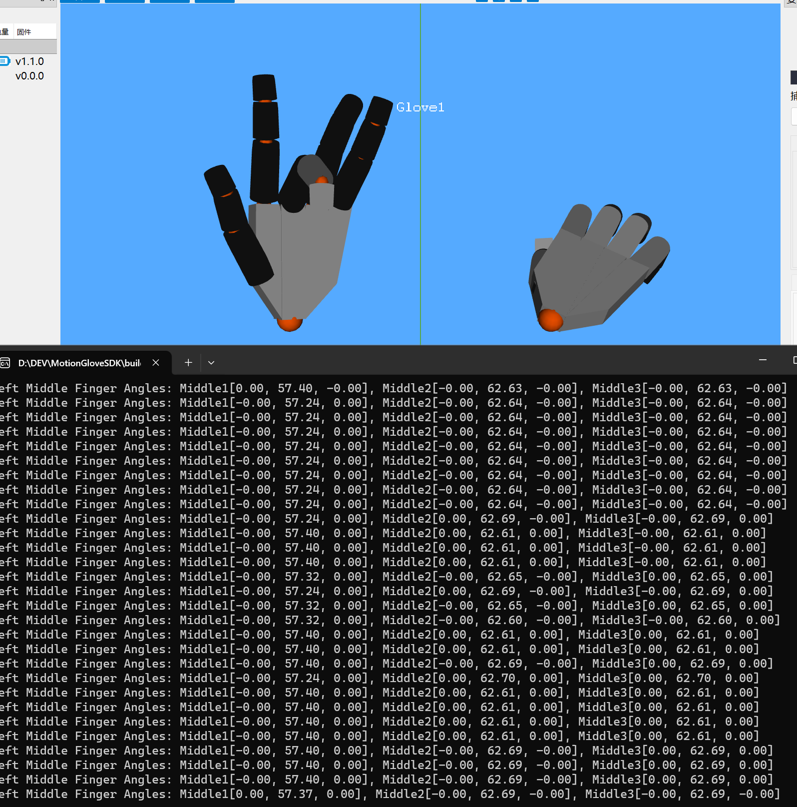

# MotionGloveSDK

## 工程结构

```
MotionGloveSDK/                        # 仓库根目录
├── CMakeLists.txt                     # 顶层 CMake，构建 SDK 库 + 示例程序
├── CMakeSettings.json                 # Visual Studio CMake 配置文件
├── LICENSE
├── README.md
├── 编译教程.pdf
│
├── MotionGloveSDK/                    # SDK 库子工程
│   ├── CMakeLists.txt                 # 编译为共享库 (DLL/SO)
│   ├── include/                       # 公开头文件
│   │   ├── motionGloveSDK.h
│   │   ├── motionGloveSDK_commonDef.h
│   │   ├── motionGloveSDK_HMAXGloveDef.h
│   │   └── motionGloveSDKDef.h
│   ├── inc/                           # 内部头文件
│   │   ├── decodeAsGloveCSV.h
│   │   ├── eulerToQuat.h
│   │   ├── motionGloveSdkHelper.h
│   │   ├── readWriteLock.h
│   │   └── resource.h
│   └── src/                           # 库源文件
│       ├── decodeAsGloveCSV.cpp
│       ├── eulerToQuat.cpp
│       ├── motionGloveSDK.cpp
│       └── motionGloveSdkHelper.cpp
│
├── MotionGloveSDK_examples/           # 示例程序（自动扫描 *example*.cpp）
│   └── src/
│       ├── motionGloveSDK_example1.cpp
│       ├── motionGloveSDK_example2.cpp
│       ├── motionGloveSDK_example3.cpp
│       ├── motionGloveSDK_example4.cpp
│       └── motionGloveSDK_example5.cpp
│
├── out/                               # 构建输出（git 忽略）
│   ├── build/x64-Debug/
│   ├── build/x64-Release/
│   ├── install/x64-Debug/
│   └── install/x64-Release/
│
├── [Windows]build_vs2022.bat          # 一键构建脚本（Visual Studio 2022）
├── [Windows]build_vs2026.bat          # 一键构建脚本（Visual Studio 2026）
├── [Windows]git_pull_latest.cmd       # 拉取最新代码
├── [Windows]open_in_vscode.bat        # 用 VSCode 打开工程
├── [Linux]build.sh                    # 一键构建脚本（Linux/Ubuntu）
├── [Linux]git_pull_latest.sh          # 拉取最新代码
└── [Linux]open_in_vscode.sh           # 用 VSCode 打开工程
```

---

## 构建方法

### 快速构建（推荐）

直接运行对应平台的一键脚本，自动完成 Debug 和 Release 两套构建与安装：

**Windows（Visual Studio 2022）**
```
双击运行 [Windows]build_vs2022.bat
```

**Windows（Visual Studio 2026）**
```
双击运行 [Windows]build_vs2026.bat
```

**Linux / Ubuntu**
```bash
bash "[Linux]build.sh"
```

---

### 手动构建

#### Windows（Visual Studio 2022）

编译 Debug：
```console
cmake -S . -B out/build/x64-Debug -G "Visual Studio 17 2022" -A x64 -DCMAKE_CONFIGURATION_TYPES="Debug"
cmake --build out/build/x64-Debug --config Debug
cmake --install out/build/x64-Debug --config Debug --prefix out/install/x64-Debug
```

编译 Release：
```console
cmake -S . -B out/build/x64-Release -G "Visual Studio 17 2022" -A x64 -DCMAKE_CONFIGURATION_TYPES="Release"
cmake --build out/build/x64-Release --config Release
cmake --install out/build/x64-Release --config Release --prefix out/install/x64-Release
```

#### Windows（Visual Studio 2026）

与 VS 2022 相同，将生成器改为 `"Visual Studio 18 2026"`：
```console
cmake -S . -B out/build/x64-Debug -G "Visual Studio 18 2026" -A x64 -DCMAKE_CONFIGURATION_TYPES="Debug"
cmake --build out/build/x64-Debug --config Debug
cmake --install out/build/x64-Debug --config Debug --prefix out/install/x64-Debug
```

#### Linux / Ubuntu

编译 Debug：
```console
cmake -S . -B out/build/x64-Debug -DCMAKE_BUILD_TYPE=Debug
cmake --build out/build/x64-Debug
cmake --install out/build/x64-Debug --prefix out/install/x64-Debug
```

编译 Release：
```console
cmake -S . -B out/build/x64-Release -DCMAKE_BUILD_TYPE=Release
cmake --build out/build/x64-Release
cmake --install out/build/x64-Release --prefix out/install/x64-Release
```

---

## 构建产物

| 平台    | 库文件                                         | 安装目录                   |
|---------|------------------------------------------------|----------------------------|
| Windows | `MotionGloveSDK.dll` / `MotionGloveSDK.lib`   | `out/install/x64-Debug/`   |
| Linux   | `libMotionGloveSDK.so`                         | `out/install/x64-Debug/`   |

示例可执行文件生成在各自的 `out/build/x64-Debug/` 或 `out/build/x64-Release/` 目录下。

---

## 注意事项

- Linux 脚本存储在 VMware hgfs 共享文件夹时，`make` 可能输出时钟偏差警告（`文件修改时间在未来`），这是宿主机与虚拟机时钟差异导致的，**不影响构建结果**，可忽略。
- Linux 脚本需要有执行权限：`chmod +x "[Linux]build.sh"`

---

## 软件配置与运行

### 1. 打开 MotionGlove

数据手套开机，首先打开 MotionGlove 数据手套客户端，确保客户端已连接数据手套并正常运行：



**网络配置：**

- **本机测试（Windows）**：在软件菜单栏 -> 设置 -> 插件 -> 数据转发 中添加 `127.0.0.1` 端口 `5000`（软件默认已添加）


- **局域网测试**：填入运行 MotionGloveSDK 的 PC 网络 IP 地址。
- **Ubuntu 测试**：填入运行 MotionGloveSDK 的 PC 网络 IP 地址，确保与 Ubuntu 系统网络畅通。

转发规则如下：



---

### 2. 例程测试

> 以下以 Debug 版本为例讲解功能。

#### 2.1 motionGloveSDK_example1

**测试目的：** 测试是否接收到了 MotionGloveSDK 的数据转发，默认使用 UDP 监听本地 `5001` 端口。

**使用流程：**

1. 打开 MotionGlove 软件，并且手套连接正常。
2. 确保在软件菜单栏 -> 设置 -> 插件 -> 数据转发 中添加了 `127.0.0.1` 端口 `5000`（软件默认已添加）。



如果运行正常，会打印出收到数据帧的帧序号，每秒 60 帧。

3. 双击运行编译输出目录中的 `motionGloveSDK_example1d.exe`。



打印 `New frame received` 代表收到了转发的数据。



---

#### 2.2 motionGloveSDK_example2

**测试目的：** 测试左右手手背的角度。

手背角度所在的坐标系为 MotionGlove 软件 3D 窗口左下角标识的坐标系。



---

#### 2.3 motionGloveSDK_example3

**测试目的：** 测试左手拇指三段骨骼的角度。

| 骨骼段 | 角度参考 |
|--------|----------|
| 第 1 段 | 相对于手背的角度 |
| 第 2 段 | 相对于第 1 段的角度 |
| 第 3 段 | 相对于第 2 段的角度 |



**数据示例（最后一行输出）：**

```
Thumb1[58.75, 60.60, -71.97]  Thumb2[-4.14, 27.18, 1.00]  Thumb3[-8.88, 80.38, 7.50]
```

- **第 1 段**：相对于手背的角度，是所有手指里角度最复杂的一段。
- **第 2 段**：由于指关节自由度限制，可忽略 XZ 轴，只关心 Y 轴的 27.18°。
- **第 3 段**：由于指关节自由度限制，可忽略 XZ 轴，只关心 Y 轴的 80.38°。

> 整体弯曲角度 = 第 2 段 + 第 3 段 Y 轴之和：27.18 + 80.38 = **107.56°**

---

#### 2.4 motionGloveSDK_example4

**测试目的：** 测试左手中指三段骨骼的角度。

| 骨骼段 | 角度参考 |
|--------|----------|
| 第 1 段 | 相对于手背的角度 |
| 第 2 段 | 相对于第 1 段的角度 |
| 第 3 段 | 相对于第 2 段的角度 |



**数据示例（最后一行输出）：**

```
Middle1[0.00, 57.37, 0.00]  Middle2[-0.00, 62.69, -0.00]  Middle3[-0.00, 62.69, -0.00]
```

- **第 1 段**：由于指关节自由度限制，可忽略 XZ 轴，只关心 Y 轴的 57.37°。
- **第 2 段**：由于指关节自由度限制，可忽略 XZ 轴，只关心 Y 轴的 62.69°。
- **第 3 段**：由于指关节自由度限制，可忽略 XZ 轴，只关心 Y 轴的 62.69°。

> 整体弯曲角度 = 三段 Y 轴之和：57.37 + 62.69 + 62.69 = **182.75°**

食指、中指、无名指、小指均可按照上述方法计算相对角度。
